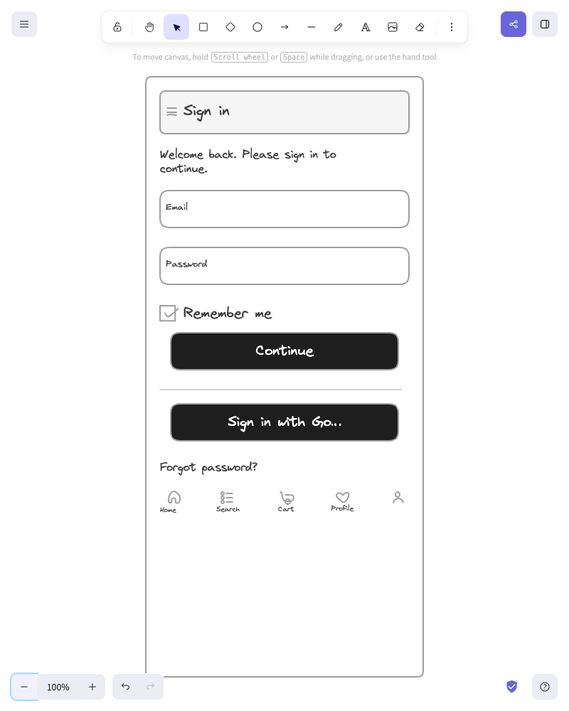
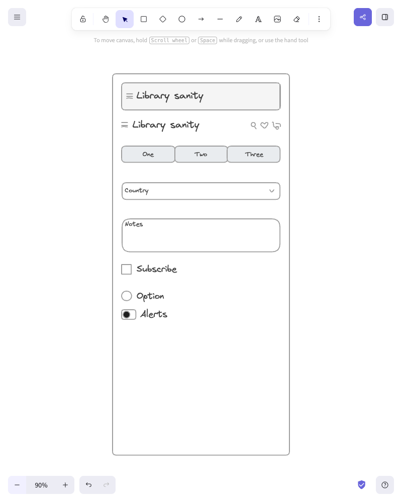

# Seer

**Visual verification for coding agents on macOS.**

Seer gives Codex and Claude Code one machine-readable CLI for a repeatable native-UI feedback loop: check capabilities, find a window, capture it, inspect the visible result, and compare it with an explicitly approved baseline. Screenshots, diffs, recordings, and reports stay local under `.seer/`.

Seer is an evidence layer, not another desktop automation framework. Your agent changes the code; Seer verifies what actually appeared on screen.

[](https://github.com/w00ing/seer-skill/releases)
[](https://github.com/w00ing/seer-skill/blob/main/LICENSE)

> macOS only. No model API key or background daemon. Window capture requires Screen Recording and Accessibility permissions.

## Install

### Codex

Run `$skill-installer`, then ask:

```text
Install the `seer` skill from GitHub repository `w00ing/seer-skill` at path `skills/seer`.
```

### Claude Code

```text
/plugin marketplace add https://github.com/w00ing/seer-skill.git
/plugin install seer-skill@seer
```

If the marketplace already exists, run `/plugin marketplace update seer` first.

## Try it

Codex:

```text
$seer Capture the frontmost app, inspect the visible UI, and verify my latest change.
```

Claude Code plugin:

```text
/seer-skill:seer Capture the frontmost app, inspect the visible UI, and verify my latest change.
```

Or ask either agent:

```text
Use Seer to capture the Settings window and compare it with the approved `settings` baseline. If no baseline exists, report it and ask before creating one.
```

## 30-second verification loop

Image verification requires Pillow in the active `python3` environment. If it is not already available:

```bash
python3 -m venv .local/venv
source .local/venv/bin/activate
python -m pip install pillow
```

Then run the shipped CLI from a clone:

```bash
SEER=skills/seer/scripts/seer

"$SEER" doctor --json
"$SEER" windows --json
"$SEER" capture --process "Preview" --out .seer/capture/current.png --json

# No baseline is silently approved. This returns needs_baseline (exit 3).
"$SEER" verify .seer/capture/current.png settings --json

# Inspect current.png, then create a baseline only after approval.
"$SEER" verify .seer/capture/current.png settings --create-baseline --json

# After a UI change, allow at most 0.5% changed pixels.
"$SEER" capture --process "Preview" --out .seer/capture/current.png --json
"$SEER" verify .seer/capture/current.png settings --max-diff-percent 0.5 --json
```

Each command emits at most one JSON object to stdout; diagnostics go to stderr. Capture paths are returned as `artifacts.current`. Verification writes the current image, diff, history, and report under `.seer/loop/`.

| Status | Exit | Meaning |
|---|---:|---|
| `pass` | 0 | Changed pixels are within the allowed threshold. |
| `fail` | 1 | The visual difference exceeds the threshold. |
| `error` | 2 | A command, permission, dependency, or input failed. |
| `needs_baseline` | 3 | No approved baseline exists; Seer did not create one. |

The default threshold is 0%. A failed `doctor` still emits its capability report with `status: error`; other failures may leave stdout empty.

## Demo


[View the full demo video](assets/seer-demo.mov)

## Core commands

| Task | Command |
|---|---|
| Check required capabilities | `skills/seer/scripts/seer doctor --json` |
| List visible app windows | `skills/seer/scripts/seer windows --json` |
| Capture a visible app window | `skills/seer/scripts/seer capture --process <name> --json` |
| Verify against a named baseline | `skills/seer/scripts/seer verify <current.png> <name> --json` |
| Record a short app flow | `bash skills/seer/scripts/record_app_window.sh --duration 3` |
| Summarize a recording | `bash skills/seer/scripts/summarize_video.sh <video.mov> --sheet --gif` |

Use `--help` on the CLI or a subcommand for complete options. `windows` reports a 1-based index, but capture currently targets the selected process's first window; stable window IDs are not yet supported. Pillow is required for image comparison and annotation; ffmpeg and ffprobe are optional unless you use video workflows.

## Advanced workflows

- `record_screen.sh`: full-display or region recording, including manual-stop ffmpeg capture.
- `capture_app_window.sh` and `loop_compare.sh`: lower-level capture and visual-loop commands used by the unified CLI.
- `extract_frames.sh`: fixed-FPS frame extraction.
- `mockup_ui.sh` and `annotate_image.py`: screenshot annotations; run `annotate_image.py --spec-help` for the JSON schema.
- `excalidraw_from_text.py`: natural-language-to-Excalidraw wireframes. See [Excalidraw wireframing](docs/excalidraw-wireframing.md).
- `type_into_app.sh`: explicit, state-changing typing through System Events.

### Excalidraw examples

| Generated sign-in wireframe | Explicit library components |
| --- | --- |
|  |  |

See [Visual loop internals](docs/visual-loop.md) for the underlying image metrics.

## Artifact layout

```text
.seer/
├── capture/      window screenshots
├── record/       recordings, frames, contact sheets, and GIFs
├── mockup/       annotated screenshots and specs
├── excalidraw/   generated .excalidraw scenes
└── loop/
    ├── baselines/
    ├── latest/
    ├── history/
    ├── diffs/
    └── reports/
```

Set `SEER_OUT_DIR` to change the output root or `SEER_LOOP_DIR` to change only visual-verification storage. Add `.seer/` to the target project's `.gitignore` unless you intentionally version its baselines.

## Permissions and troubleshooting

- `error: window not found`: start the app, check its process name, and ensure it has a visible window.
- Empty or black capture: grant Screen Recording permission to the terminal running the agent.
- Wrong window: use `windows --json`, then pass the exact process name to `capture`.
- Typing fails: grant Accessibility and Automation → System Events permissions.
- Diff command reports missing Pillow: install it in the `python3` environment used by Seer.

## Development

```bash
python3 -m venv .local/venv
.local/venv/bin/python -m pip install pillow
.local/venv/bin/python -m unittest discover -s tests -v
python3 skills/seer/scripts/test_excalidraw.py
```

Shell scripts are checked on macOS CI. Claude packaging can be validated locally with:

```bash
claude plugin validate --strict .
```

## License

MIT
